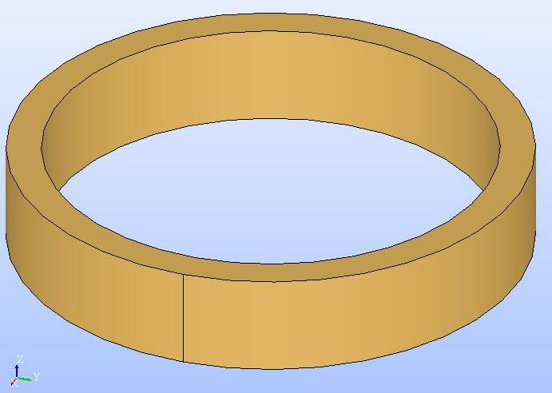
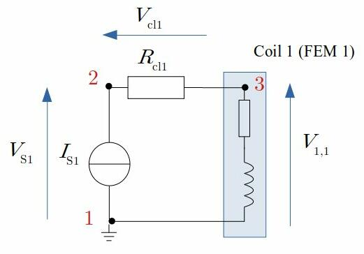

# Elmerfem: coupling FEM-circuit, handling via jupyter notebook

## Pre-requisites

- Jupyter and python 3.x
- FEM solver: [Elmerfem](http://www.elmerfem.org/blog/)
- Geometry builder and mesher: [salome platform](https://www.salome-platform.org/)
- Result visualization with [paraview](https://www.paraview.org/)

As 2022, tested with Elmerfem 9.0 and Salome 9.9.0  

## Bashmode or Jupyter

To make the *.sh files executable: "chmod u+x *.sh"  
1- Run the solver without log file: "bash run.sh" or "./run.sh"  
2- Run the solver with log file: "bash run.sh logfilename" or "./run.sh logfilename"  
3- Run the geometry builder and mesher alone: ./meshGeneration.sh  
4- Compile the User Defined Functions (UDF) alone: ./compileUDF.sh  
5- Run step 3 and 4 combined: "./main.sh" or "./main.sh logfilename"

The case study can be opened in a jupyter notebook: `jupyter notebook elmerNotebook.ipynb` and run from there. You need to change some variables defining the location of `salome` and `gmsh` in your OS.

# Electromagnetic model: coil connected to an external electrical circuit

The FEM model deals with the electromagnetic behavior of the coil while the external circuit model describes electric behavior of the system.
The external circuit is made of a DC power source supplying a current to a coil modeled by FEM. A resistance connecting the power supply to the coil is used to account for the current leads.

<table>
 <tr>
   <td></td>
   <td></td>
 </tr>
 <tr>
   <td style="text-align:center">Coil geometry: FEM 1</td>
   <td style="text-align:center">Circuit</td>
 </tr>
</table>
